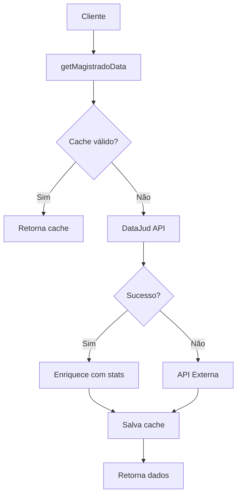

# 🏛️ Judge Service API - Integração com DataJud e PJe

> **Rick Dev-9000**: *Finalmente, um serviço de magistrados que não é uma gambiarra completa. Seguindo os padrões do PJe porque, aparentemente, alguém no CNJ sabe o que está fazendo.*

## 📋 Visão Geral

Este serviço implementa integração com as APIs oficiais do sistema judiciário brasileiro, seguindo os **padrões de API do PJe** estabelecidos pelo CNJ. Porque usar APIs padronizadas é coisa de gente civilizada.

### 🎯 Funcionalidades Principais

- ✅ **Integração com DataJud**: API pública oficial do CNJ
- ✅ **Cache inteligente**: TTL de 1 hora para otimizar performance
- ✅ **Fallback robusto**: APIs externas como backup
- ✅ **Padrões PJe**: Estrutura orientada a recursos
- ✅ **Estatísticas avançadas**: Cálculos de produtividade
- ✅ **Compatibilidade**: Mantém funções legadas

## 🔧 Configuração

### Variáveis de Ambiente

```env
# API Keys (opcionais)
DATAJUD_API_KEY=sua_chave_aqui
PJE_API_KEY=sua_chave_pje_aqui

# Configurações de Cache
JUDGE_CACHE_TTL=3600000  # 1 hora em ms
```

### URLs Base

```typescript
const DATAJUD_API_BASE = 'https://api-publica.datajud.cnj.jus.br';
const PJE_API_BASE = 'https://pje.tjmg.jus.br/pje/api/v1';
```

## 🚀 Uso da API

### 1. Buscar Dados de Magistrado (Função Principal)

```typescript
import { getMagistradoData } from '../services/dashboard/judgeService';

// Busca com cache (recomendado)
const magistrado = await getMagistradoData(
  'magistrado-id-123',
  'tjmg',           // tribunal
  'api-key',        // opcional
  false             // forceRefresh
);

// Forçar atualização (ignora cache)
const magistradoFresh = await getMagistradoData(
  'magistrado-id-123',
  'tjmg',
  'api-key',
  true              // força refresh
);
```

### 2. Buscar Processos por Magistrado

```typescript
import { fetchProcessosByMagistrado } from '../services/dashboard/judgeService';

const processos = await fetchProcessosByMagistrado(
  'magistrado-id-123',
  'tjmg',
  'api-key',
  100               // limit
);

console.log(`Encontrados ${processos.length} processos`);
```

### 3. Calcular Estatísticas

```typescript
import { calculateMagistradoStats } from '../services/dashboard/judgeService';

const stats = await calculateMagistradoStats(
  'magistrado-id-123',
  'tjmg',
  'api-key'
);

console.log(`Produtividade: ${stats.produtividade.sentencas} sentenças/mês`);
```

### 4. Listar Magistrados por Tribunal

```typescript
import { listMagistradosByTribunal } from '../services/dashboard/judgeService';

const magistrados = await listMagistradosByTribunal(
  'tjmg',
  'api-key',
  50,               // limit
  0                 // offset
);
```

## 📊 Estruturas de Dados

### MagistradoDataJud (DataJud)

```typescript
interface MagistradoDataJud {
  id: string;
  nome: string;
  tribunal: string;
  orgaoJulgador: string;
  competencia: string;
  situacao: 'ativo' | 'inativo' | 'aposentado';
  dataPosse?: string;
  dataAposentadoria?: string;
}
```

### EstatisticasMagistrado

```typescript
interface EstatisticasMagistrado {
  totalProcessos: number;
  processosPendentes: number;
  processosJulgados: number;
  tempoMedioJulgamento: number; // em dias
  produtividade: {
    mes: number;
    ano: number;
    sentencas: number;
    decisoes: number;
    despachos: number;
  };
}
```

### PJeApiResponse (Padrão)

```typescript
interface PJeApiResponse<T> {
  status: 'ok' | 'error' | 'in-progress';
  code: number;
  data?: T;
  messages?: string[];
  timestamp?: string;
}
```

## 🔄 Fluxo de Dados



## 🛡️ Tratamento de Erros

### Estratégia de Fallback

1. **Cache local** (se válido)
2. **DataJud API** (oficial)
3. **API externa** (backup)
4. **Cache expirado** (último recurso)
5. **Erro** (se tudo falhar)

### Códigos de Erro

```typescript
// Erros comuns
- 401: API Key inválida
- 404: Magistrado não encontrado
- 429: Rate limit excedido
- 500: Erro interno do servidor
- 503: Serviço indisponível
```

## 🎯 Endpoints Seguindo Padrões PJe

### Estrutura de URLs

```
/api/v1/magistrados                    # Lista magistrados
/api/v1/magistrados/{id}               # Dados específicos
/api/v1/magistrados/{id}/processos     # Processos do magistrado
/api/v1/magistrados/{id}/estatisticas  # Estatísticas
/api/v1/tribunais/{tribunal}/magistrados # Por tribunal
```

### Verbos HTTP

- `GET`: Recupera dados
- `POST`: Busca com filtros complexos
- `PUT`: Atualiza cache (admin)
- `DELETE`: Remove cache (admin)

## 🚀 Performance e Cache

### Configurações de Cache

```typescript
const CACHE_TTL = 3600000; // 1 hora

// Estrutura no MongoDB
{
  id: 'magistrado-123',
  ...dadosMagistrado,
  lastUpdated: new Date(),
  cacheExpiry: new Date(Date.now() + CACHE_TTL)
}
```

### Otimizações

- ✅ **Cache com TTL**: Evita requests desnecessários
- ✅ **Lazy loading**: Estatísticas sob demanda
- ✅ **Batch requests**: Múltiplos magistrados
- ✅ **Compression**: Headers otimizados

## 🔐 Segurança

### Autenticação

```typescript
// Header padrão DataJud
Authorization: APIKey sua_chave_aqui

// Headers de segurança
{
  'Content-Type': 'application/json',
  'Accept': 'application/json',
  'User-Agent': 'iAdv-Backend/1.0.0'
}
```

### Validações

- ✅ **Input sanitization**: Todos os parâmetros
- ✅ **Rate limiting**: Controle de requests
- ✅ **Error masking**: Não expõe internals
- ✅ **Audit logging**: Todas as operações

## 📈 Monitoramento

### Métricas Importantes

```typescript
// Logs estruturados
console.log({
  action: 'magistrado_fetch',
  magistradoId: id,
  source: 'datajud|cache|external',
  duration: Date.now() - startTime,
  success: true
});
```

### Health Checks

- DataJud API status
- Cache hit rate
- Response times
- Error rates

## 🔄 Migração e Compatibilidade

### Funções Legadas (Mantidas)

```typescript
// Aliases para compatibilidade
export const fetchJuizFromExternalApi = fetchMagistradoFromDataJud;
export const saveJuizToDatabase = saveMagistradoToDatabase;
export const getJuizFromDatabase = getMagistradoFromDatabase;
```

### Migração Gradual

1. **Fase 1**: Implementar novas funções
2. **Fase 2**: Migrar controllers
3. **Fase 3**: Deprecar funções antigas
4. **Fase 4**: Remover código legado

## 🧪 Testes

### Casos de Teste

```typescript
// Exemplo de teste
describe('getMagistradoData', () => {
  it('should return cached data when available', async () => {
    // Mock cache
    // Test cache hit
  });
  
  it('should fetch from DataJud when cache expired', async () => {
    // Mock expired cache
    // Test API call
  });
});
```

## 📚 Referências

- [Padrões de API do PJe](https://docs.pje.jus.br/manuais-basicos/padroes-de-api-do-pje)
- [API Pública DataJud](https://www.cnj.jus.br/sistemas/datajud/api-publica/)
- [Documentação CNJ](https://datajud-wiki.cnj.jus.br/api-publica/)

---

> **Rick**: *Agora você tem um serviço de magistrados que não é uma vergonha para a humanidade. Use com sabedoria, Morty.*